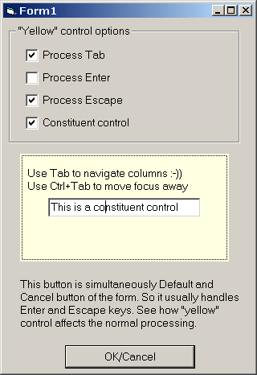



## How to capture Tab/Enter/Esc on your custom UserControl

### Description

Before starting the project register the oleguids3.tlb from the zip.

----

This is an example of a usercontrol that intercepts vbKeyTab, vbKeyEnter and vbKeyEsc keys WITHOUT using windows hooks. The idea is to place a custom implementation on the IOleInPlaceActiveObject interface of the usercontrol and to implement custom handling in TranslateAccelerator method. The idea is by Mike Gainer, Matt Curland and Bill Storage and the implementation can be found on vbAccelerator.com. Another interesting idea shown is how to "simulate" pressing tab key on the form as to be able to tab out of the control with ctrl+tab for instance. Greetings go to ORSHEE (for his grid control) and to José Pablo Ramírez Vargas (for not believing this is possible)! Enjoy, and check out my other controls submissions!
 
### More Info
 

             |
---                |---
**Submitted On**   |2002-12-12 11:51:40
**By**             |[Vlad Vissoultchev](https://github.com/Planet-Source-Code/PSCIndex/blob/master/ByAuthor/vlad-vissoultchev.md)
**Level**          |Advanced
**User Rating**    |5.0 (70 globes from 14 users)
**Compatibility**  |VB 6\.0
**Category**       |[OLE/ COM/ DCOM/ Active\-X](https://github.com/Planet-Source-Code/PSCIndex/blob/master/ByCategory/ole-com-dcom-active-x__1-29.md)
**World**          |[Visual Basic](https://github.com/Planet-Source-Code/PSCIndex/blob/master/ByWorld/visual-basic.md)
**Archive File**   |[How\_to\_cap15126312132002\.zip](https://github.com/Planet-Source-Code/vlad-vissoultchev-how-to-capture-tab-enter-esc-on-your-custom-usercontrol__1-41506/archive/master.zip)

